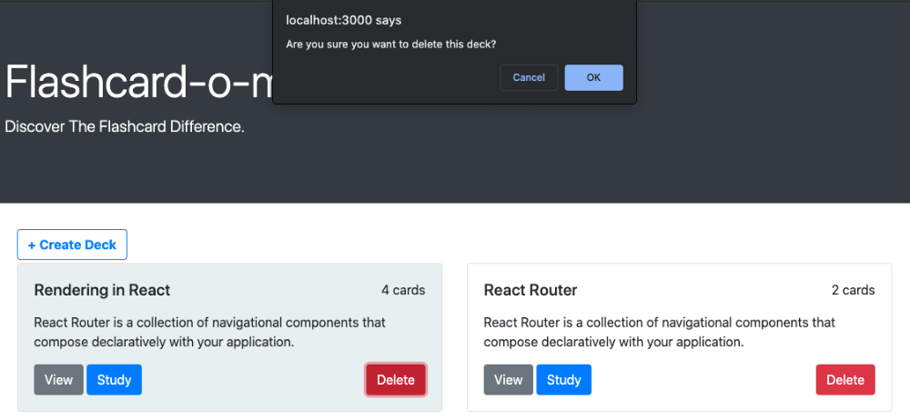

# Flashcard-o-matic

## Description

Flashcard-o-matic is a simple online learning tool designed to help students study course content with flashcards.

## Demo

[Flashcard-o-matic](https://flashcard-o-matic-peach.vercel.app/)

## Flash-card-o-matic Express API

[Flashcard-o-matic-server](https://github.com/meleciosilva/flashcard-o-matic-server)

## Getting Started

### Home

- **Create Deck**: input a deck name and brief description; users will then be directed to the deck page
- **View**: directs users to the deck page where they can get an overview of deck contents
- **Study**: directs users to an interactive study session with the deck's flashcards
- **Delete**: users also have the option to delete the deck and all of its contents

### View

#### Deck

- **Edit**: users are able to edit the deck name and description
- **Study**: enter study mode
- **Add Cards**: add individual cards to a selected deck
- **Delete**: Delete deck

#### Cards

- **Edit**: Edit card front and back
- **Delete**: Delete card

### Study

- **Flip**: view the back of the card
- **Next**: view the next card
- **Previous**: view the previous card

## Technology

- Built using Bootstrap and React to design and manage the user-interface, respectively
- Implemented React Hooks and React Router to manage API calls for data and component routing, respectively

## Future Goals

- Animated card flips in Study mode
- Score feature to gamify and improve user experience
- Quiz feature to demonstrate mastery of topics
